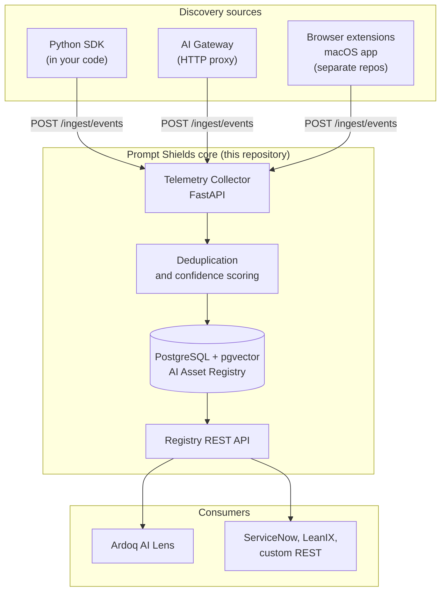

# Prompt Shields SDK

Prompt Shields discovers and catalogues every AI system running inside an organisation — sanctioned or not — and publishes that inventory to your Enterprise Architecture tooling.

## The problem

Most organisations cannot answer a basic governance question: which business processes depend on which models, holding which data, owned by whom. Procurement records miss the API key a team expensed last quarter, CMDB entries miss the LLM call buried in a microservice, and neither sees the employee pasting customer records into a browser chatbot. Without a live inventory, EU AI Act classification, ISO 42001 scoping, and third-party risk review are all performed against a guess — and the controls you design protect a system you have never actually enumerated.

## Quickstart

Requires Docker and Python 3.11 or newer. Runs entirely on your machine; no Prompt Shields account and no LLM API key are needed.

```bash
git clone https://github.com/Bit-Pulse-AI/prompt-shields-sdk.git && cd prompt-shields-sdk
docker compose up -d
pip install -e "packages/sdk[all]" -e "packages/collector[dev]"
until docker compose exec -T db pg_isready -q; do sleep 1; done && (cd packages/db && PYTHONPATH=../../packages alembic upgrade head)
PYTHONPATH=packages:packages/collector python3 demo/seed_data.py && python3 demo/demo_sdk_flow.py
```

The demo ingests an event, then reads the resulting asset back out of the registry. The registry is then browsable at `http://localhost:8000/api/v1/registry/assets` with the header `Authorization: Bearer ps-demo-key-acme`.

Seeding is one-shot. It creates a demo tenant each time it runs, so re-run it only against a fresh database.

## How does it work?

Prompt Shields separates *collection* from *inventory*. Several independent collectors observe AI usage and emit events; one collector service turns that stream of events into a deduplicated register of assets.

An **AI asset** is a single AI use case as an auditor would describe it — one vendor, one model, one business unit, one purpose, for example "HR screening interview transcripts with GPT-4o". A **discovery source** is a mechanism that observes AI usage and reports it: this repository contains two of them (SDK and gateway), and the browser extensions and macOS desktop app that capture shadow AI live in separate repositories and feed the same collector.



### The SDK

The **Python SDK** is a drop-in wrapper around the OpenAI and Anthropic clients that records metadata about each call without changing its result. You swap the constructor and annotate the call site with business context; the request and response themselves pass through untouched.

```python
from prompt_shields import ShieldsOpenAI

client = ShieldsOpenAI(
    api_key="sk-...",                    # provider key, hashed before any event is sent
    ps_api_key="ps-...",                 # Prompt Shields tenant key
    ps_collector_url="http://localhost:8000",
    business_unit="HR",
    use_case="interview-screening",
    owner="jane.doe@acme.com",
    data_classification="confidential",
    environment="production",
)

response = client.chat.completions.create(
    model="gpt-4o",
    messages=[{"role": "user", "content": "Summarise this candidate..."}],
    ps_metadata={"data_sources": ["candidates_db"], "risk_tags": ["pii", "gdpr"]},
)
```

`ShieldsAnthropic`, `AsyncShieldsOpenAI`, and `AsyncShieldsAnthropic` present the same surface. What leaves the host is vendor, model, token counts, latency, estimated cost, a truncated SHA-256 fingerprint of your provider key, the business context above, and PII *category labels*. Prompt text is sent only if you set `send_prompt_text=True`; response text is never sent.

The SDK is **fail-open**, meaning a failure in the telemetry path is swallowed rather than raised, so an unreachable collector degrades discovery instead of breaking the LLM call your application depends on.

### The gateway

An **AI gateway** is an HTTP proxy that sits between an application and a model provider, so it can observe traffic without the application being modified. This repository vendors a focused fork of [Portkey AI Gateway](https://github.com/Portkey-AI/gateway) (MIT) and adds `gateway/src/middlewares/ps-telemetry.ts`, which reads `X-PS-*` headers for business context and forwards usage metadata to the collector. See the limits in the next section before planning around it.

### The collector and registry

The **telemetry collector** is a FastAPI service that accepts events on `POST /ingest/events` and resolves each one to an asset. **Deduplication** is the step that decides whether an incoming event describes an asset already on the register or a new one, matching on tenant, vendor, model, use case, business unit, and environment. A **confidence score** records how many independent discovery sources have corroborated an asset: `low`, `medium`, `high`, or `verified`.

The **AI Asset Registry** is the resulting inventory — the durable list of assets with their owners, classifications, data flows, and risk mappings. A **data flow** records which system supplies input to an asset and where its output goes; a **risk mapping** links an asset to a named control framework such as the EU AI Act, NIST AI RMF, or ISO 42001.

```
GET /api/v1/registry/assets                    List assets, filterable
GET /api/v1/registry/assets/{id}               Asset detail
GET /api/v1/registry/assets/{id}/data-flows    Data lineage
GET /api/v1/registry/assets/{id}/risks         Risk mappings
GET /api/v1/registry/vendors                   Distinct vendors in use
GET /api/v1/registry/models                    Distinct models in use
GET /api/v1/registry/search?q=...              Semantic search over asset metadata
```

`demo/ardoq_recipe.json` is an [Ardoq Integration Builder](https://help.ardoq.com/en/articles/44154-integration-builder) recipe that reads these endpoints and writes assets, vendors, data flows, and risk mappings into Ardoq AI Lens.

### Running the tests

```bash
PYTHONPATH=packages/sdk python3 -m pytest packages/sdk/tests -q                     # 49 tests, no database
PYTHONPATH=packages:packages/collector python3 -m pytest packages/collector/tests -q  # 18 tests, needs PostgreSQL
PYTHONPATH=packages:packages/collector python3 -m pytest tests -q                   # 1 end-to-end test, needs PostgreSQL
```

Invoke the three suites one at a time. A bare `pytest`, or any invocation covering more than one of these directories, fails during collection: all three `tests/` directories are packages named `tests`, so their `conftest.py` files collide on module name.

## What this does not do

This is a discovery and inventory tool. It is not a control, and the sections below are the boundary of what it can be relied upon for.

**It does not block anything.** No prompt, response, tool call, or model is ever filtered, redacted, rewritten, rate-limited, or refused. Every call proceeds exactly as it would without Prompt Shields; the only change is that a record is written. Despite the product name, there is no prompt-injection, jailbreak, or unsafe-output defence anywhere in this repository.

**PII detection is a signal, not a DLP control.** It is regular-expression and keyword matching over prompt text, run locally, and it is wrong in both directions. `10.2.14.3` in a release note is reported as `ip_address`; a sixteen-digit order number is reported as both `credit_card` and `phone`; `Jane Doe, 14 Rue Lafayette, Paris` is reported as nothing at all. Names, postal addresses, free-text identifiers, and anything in a language or format not covered by the patterns are missed. Treat the output as a hint about where to look, never as evidence that a payload was clean.

**Discovery is opt-in per code path, and silent where it is not applied.** The SDK requires a code change at the call site; the gateway requires traffic to be routed through it. Any code path that does neither is invisible to the register, and the register cannot tell you that it is missing. There is no network scanning, no eBPF, no egress inspection, and no agent that finds AI usage you have not instrumented. An empty result means nothing was reported, not that nothing is running.

**`verified` does not mean a human verified it.** Confidence is a count of distinct discovery sources. Two automated sources reporting the same asset yields `verified`; no human review is involved at any point, and a persistently wrong owner or classification will be scored `verified` just the same.

**The register is not an audit log.** Telemetry is fail-open and lossy by design. Events buffer in memory, up to 1,000 per client, and the oldest are dropped on overflow; the buffer is not persisted, so anything unsent is lost when the process exits. Nothing reconciles what was sent against what was received. Do not present the register as a complete record of AI usage in a regulatory or evidentiary context.

**The gateway middleware is not wired in.** `ps-telemetry.ts` is present and documented, but it is not registered in the gateway's request pipeline — nothing imports it. As vendored, routing traffic through the gateway emits no telemetry. Wiring the middleware into the fork is outstanding work, so treat gateway-based discovery as unavailable rather than merely unconfigured.

**The collector is not hardened for production.** It authenticates by looking up the bearer token as plaintext in the tenant record, which the source flags as a Phase 1 shortcut that must not be deployed. `rate_limit_per_minute` is defined in configuration but not enforced anywhere. There is no TLS termination, no role-based access control, no encryption at rest, no data-retention or deletion policy, and no audit logging of registry reads. Tenant isolation is a `tenant_id` predicate on each query, not database row-level security, so it holds only as far as the application code is correct.

**Semantic search calls OpenAI.** When `OPENAI_API_KEY` is set on the collector, asset metadata — vendor, model, use case, business unit — is sent to OpenAI's embeddings API to build the search index. Leave the variable unset and embeddings are skipped, disabling `/search` but keeping asset metadata inside your network.

**Shadow AI capture is not in this repository.** The browser extensions and macOS app that detect employees using ChatGPT, Gemini, and Copilot are separate products. Cloning this repository gives you developer-side and infrastructure-side discovery only.

## Free vs Prompt Shields Cloud

<!--
DRAFT. The commercial boundary below was reconstructed from what is present in
this repository against what the documentation points at hosted infrastructure
(app.promptshields.io, api.promptshields.io, the Partner API and its OAuth 2.0,
delta-sync and export endpoints). It has not been confirmed against the
canonical boundary statement. Replace this section before publication.
-->

Everything in this repository is self-hosted and runs without a Prompt Shields account.

| | This repository, self-hosted | Prompt Shields Cloud |
|---|---|---|
| Python SDK, telemetry collector, registry API | Yes | Yes |
| AI Gateway fork | Yes, self-built | Managed |
| Ardoq recipe and custom REST integration | Yes | Yes |
| Hosted collector and registry | You run PostgreSQL and the service | Managed, at `api.promptshields.io` |
| Browser extensions and macOS app for shadow AI | Not included | Included |
| Governance dashboard | Not included | `app.promptshields.io` |
| Partner API for EA tools — OAuth 2.0, delta sync, bulk export | Not included | Included |
| Managed multi-tenancy, sandbox environment, status page | Not included | Included |
| Operational responsibility — upgrades, backups, hardening | Yours | Prompt Shields |
| Support and service levels | Community, best effort | Contractual |

The self-hosted path carries the hardening gaps listed in the section above; closing them is your responsibility.

## Links

- [Documentation](docs/) — Partner API reference, integration guides, and SDK docs (published with Mintlify)
- [Introduction and key concepts](docs/introduction.mdx)
- [Security policy](SECURITY.md) — how to report a vulnerability
- [Contributing](CONTRIBUTING.md) — development setup, tests, and pull request expectations
- [Changelog](CHANGELOG.md)
- [Fork notice](gateway/FORK_NOTICE.md) — what was changed in the vendored Portkey gateway, and its MIT licence

## Licence

The vendored AI Gateway is a fork of [Portkey AI Gateway](https://github.com/Portkey-AI/gateway), used under the MIT Licence; see [`gateway/LICENSE`](gateway/LICENSE). The Prompt Shields SDK, collector, and the extensions made to the gateway are proprietary and are not covered by that licence.
